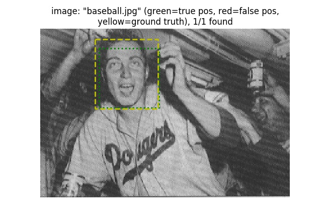
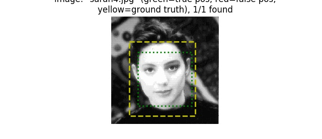
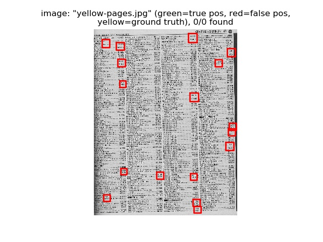
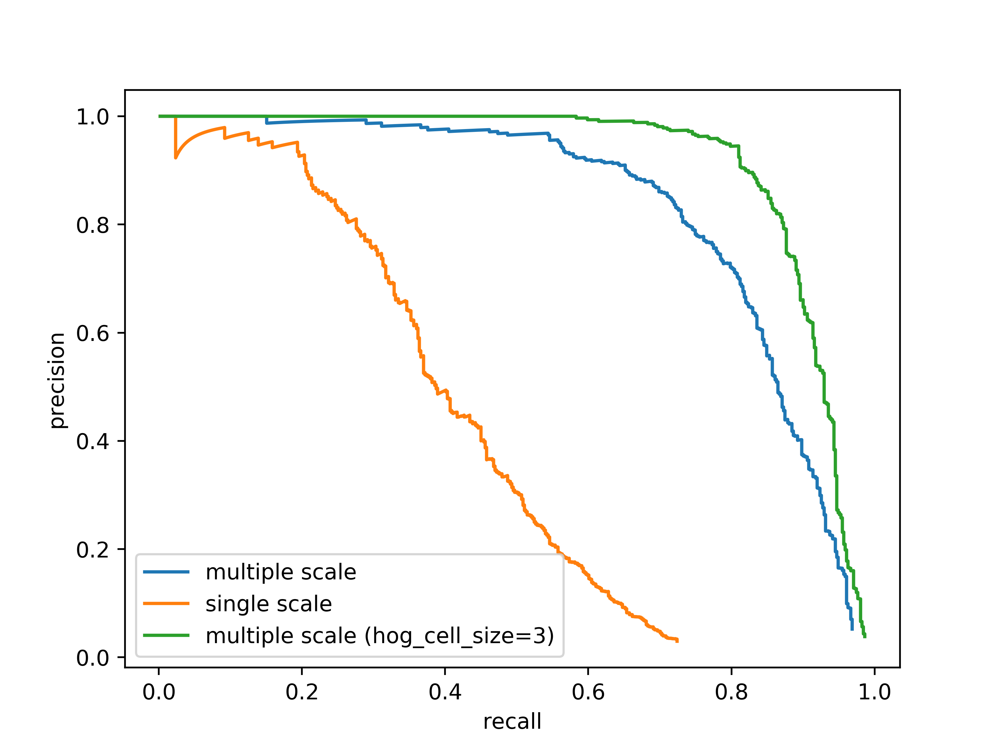

# Wei-Cheng Tseng <span style="color:red">(104061146)</span>

# Project 4 / Face Detection with a Sliding Window

## Overview
This project implements a face detection pipeline. In this project, I implement a sliding window face detector to create my own face detector.

## Bonus
- public repo: https://github.com/WeiChengTseng/NTHU-CV-hw4

## Implementation
- `get_positive_features`  
	- iterate all positive examples and extract their hog features

	```python
	if os.path.isfile('features_pos.npy') and reload:
	features_pos = np.load('features_pos.npy')
	return features_pos

    features_pos = []
    for img in tqdm(os.listdir(train_path_pos)):
        path = os.path.join(train_path_pos, img)
        img = imread(path).astype(np.float32)
        hog_f = hog(img, cell_size=feature_params['hog_cell_size'])
        features_pos.append(hog_f.reshape(-1))
    features_pos = np.array(features_pos)

    np.save('features_pos', features_pos.copy())
	```
- `get_random_negative_features.py`
	- we sample some image without face. 
	- for each image we sample, we apply crop on the image

	```python
	import glob
    template_size = feature_params['template_size']
    hog_cell_size = feature_params['hog_cell_size']
    
    neg_train_image = glob.glob(non_face_scn_path+'/*.jpg')

    # reload = False
    if os.path.isfile('features_neg.npy') and reload:
        features_neg = np.load('features_neg.npy')
        if len(features_neg) == num_samples:
            print('-> Restore negative features from {}'.format('features_neg.npy'))
            return features_neg, len(neg_train_image)
    
    features_neg = []
    n_sam = int(np.ceil(num_samples/len(neg_train_image)))
    
    for i in tqdm(range(len(neg_train_image))):
        img = imread(neg_train_image[i], as_gray=True)
        h, w = img.shape[0], img.shape[1]
        
        if min(h, w) - template_size < n_sam:
            sample_per_image = min(h, w)-template_size
        else:
            sample_per_image = n_sam
        
        h_random = np.random.choice(h-template_size, sample_per_image, replace=False)
        w_random = np.random.choice(w-template_size, sample_per_image, replace=False)
        
        for j in range(sample_per_image):
            img_n = img[h_random[j]: template_size+h_random[j], w_random[j]: template_size+w_random[j]]
            hog_feats = hog(img_n, hog_cell_size).flatten()
            features_neg.append(hog_feats)
        
    if len(features_neg) > num_samples:
        index = np.random.choice(len(features_neg), num_samples, replace=False)
        features_neg = np.asarray(features_neg)[index]
    else:
        features_neg = np.asarray(features_neg)
    neg_examples = len(neg_train_image)
    
    np.save('features_neg', features_neg.copy())
    print('-> Save negative features to {}'.format('features_neg.npy'))
	```
- `svm_classify.py`  
	- based on svm.LinearSVC(class_weight='balanced', tol=1e-5, random_state=0)
	- we use GridSearchCV to search the best hyperparameter
	
	```python
	import pickle as pkl
    import os
    import sklearn

    reload = False
    if os.path.isfile('SVM_linear.pkl') and reload:
        print('-> Restore exist model from {}'.format('SVM_linear.pkl'))
        with open('SVM_linear.pkl', 'rb') as f:
            clf = pkl.load(f)
        return clf

    print('-> Establish a new linear SVM model.')
    parameters_set = {'C': [0.1, 0.3, 0.5, 0.6, 0.7, 0.8, 0.9, 1, 1.2, 1.5, 1.7, 2.0, 2.5, 10]}
    SVM_linear = svm.LinearSVC(tol=1e-5, random_state=0)
    gv = sklearn.model_selection.GridSearchCV(SVM_linear, 
                                               parameters_set, cv=8, 
                                               scoring='accuracy',
                                               n_jobs=-1)
    print('-> Start running cross validation.')
    gv.fit(x, y[:, 0])
    print('-> Best paramters searched by GridSearchCV:', gv.best_params_)
    clf = svm.LinearSVC(tol=1e-5, random_state=0, C=gv.best_params_['C'])
    clf.fit(x, y[:, 0])

    with open('SVM_linear.pkl', 'wb') as model:
        print('-> Save model to {}'.format('SVM_linear.pkl'))
        pkl.dump(clf, model)
	```

- `run_detector.py`
	- use a flag `is_single` to determine whether we apply multiple scale pre-porcessing to the image
	- if we apply multiple scale pre-porcessing to the image, we gradual resize the image with ratio 0.9
	- only the bbox with confidence > -0.5 are selected before nms

	```python
	    img = imread(test_scn_path+ '/' +test_images[i], as_gray=True)
        h, w = img.shape[0], img.shape[1]
        scale, threshold = 1, -0.5
        
        cur_bboxes = np.zeros([0, 4])
        cur_confidences = np.zeros([0, 1])
        cur_image_ids = np.zeros([0, 1])
        
        if is_single:
            img_resize = resize(img, [int(h*scale), int(w*scale)], mode='reflect')
            hog_feature = hog(img_resize, cell_size)
            
            for y in range(0, int(hog_feature.shape[0]-cell_num+1)):
                for x in range(0, int(hog_feature.shape[1]-cell_num+1)):
                    hog_segment = np.reshape(hog_feature[y:y+cell_num, x:x+cell_num, :],(1,-1))
                    temp_confidences = np.reshape(model.decision_function(hog_segment),(1,-1))
                    if temp_confidences[0] > threshold:
                        x_min, x_max = int(x*cell_size / scale), int((x+cell_num)*cell_size / scale)
                        y_min, y_max = int(y*cell_size / scale), int((y+cell_num)*cell_size / scale)
                        
                        temp_bboxes = np.array([[x_min, y_min, x_max, y_max]])
                        cur_bboxes = np.concatenate([cur_bboxes, temp_bboxes], axis=0)
                        cur_confidences = np.concatenate([cur_confidences, temp_confidences], 0)
                        cur_image_ids = np.concatenate([cur_image_ids, [[test_images[i]]]], axis=0)
        else:
            while min(h, w)*scale > template_size:
                img_resize = resize(img, [int(h*scale), int(w*scale)], mode='reflect')
                hog_feature = hog(img_resize, cell_size)
                
                for y in range(0, int(hog_feature.shape[0]-cell_num+1)):
                    for x in range(0, int(hog_feature.shape[1]-cell_num+1)):
                        hog_segment = np.reshape(hog_feature[y:y+cell_num, x:x+cell_num, :],(1,-1))
                        temp_confidences = np.reshape(model.decision_function(hog_segment),(1,-1))
                        if temp_confidences[0] > threshold:
                            x_min, x_max = int(x * cell_size / scale), int((x+cell_num) * cell_size / scale)
                            y_min, y_max = int(y * cell_size / scale), int((y+cell_num) * cell_size / scale)
                            
                            temp_bboxes = np.array([[x_min, y_min, x_max, y_max]])
                            cur_bboxes = np.concatenate([cur_bboxes, temp_bboxes], axis=0)
                            cur_confidences = np.concatenate([cur_confidences, temp_confidences], 0)
                            cur_image_ids = np.concatenate([cur_image_ids, [[test_images[i]]]], axis=0)
                            
                scale *= 0.9
	```
- others
	- we always store a plicke file


## Installation
* How to compile from source?
- evaluate
	- ```python proj4.py```
- show result for extra_test_scenes
	- ```python output_extra_img.py```

### Results

<table border=1>
We can find that there are too many false positive.
<tr>
<td>



</td>
</tr>


</table>


<center>
<p>
Precision Recall curve for different setting.
From the figure, we can observe that small hog cell size can achieve better performance.
<p>


</center>
